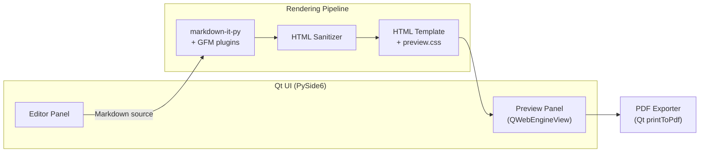

# Markdown PDF Studio

A lightweight desktop Markdown editor with live preview and one-click PDF export. Write in a split-pane interface, see GitHub-flavored rendering update as you type, and export print-ready A4 documents without leaving the app.

[](https://www.python.org/downloads/)
[](LICENSE)
[](#requirements)

---

## Table of Contents

- [Features](#features)
- [Screenshots](#screenshots)
- [Requirements](#requirements)
- [Installation](#installation)
- [Usage](#usage)
- [Keyboard Shortcuts](#keyboard-shortcuts)
- [Architecture](#architecture)
- [Project Structure](#project-structure)
- [Development](#development)
- [License](#license)

---

## Features

### Editing

- **Split-pane layout** — Markdown editor on the left, rendered preview on the right
- **Live preview** — Debounced updates (300 ms) with an optional on/off toggle
- **Formatting toolbar** — Bold, italic, underline, and text color with keyboard shortcuts
- **File management** — New, open, save, and save-as for `.md` / `.markdown` files
- **Unsaved-change protection** — Prompts before closing, opening, or creating a new file when edits are pending
- **Status bar** — File name, save state, and live word count

### Rendering

- **GitHub-flavored Markdown** — Tables, fenced code blocks, task lists, strikethrough, and autolinks
- **Syntax highlighting** — Pygments-powered highlighting for fenced code blocks
- **Footnotes** — Full footnote support via `mdit-py-plugins`
- **Safe HTML** — Inline HTML (underline, color spans) passes through a sanitizer that strips scripts and unsafe attributes
- **GitHub-style preview** — Clean, readable typography inspired by GitHub's Markdown CSS

### PDF Export

- **One-click export** — Renders the current preview to a PDF via Qt WebEngine
- **Print-ready output** — A4 portrait layout with 20 mm margins
- **WYSIWYG** — The exported PDF matches what you see in the preview panel

---

## Screenshots

> Add screenshots of the editor and a sample PDF export here.

---

## Requirements

| Requirement | Details |
|-------------|---------|
| **Python** | 3.10 or later |
| **OS** | Linux (tested on Ubuntu-based distributions) |
| **System libraries** | Qt WebEngine dependencies — on Ubuntu/Debian: `libxcb-cursor0` |

PySide6 bundles Qt, but WebEngine requires additional system packages on Linux. Install them before running the app:

```bash
# Ubuntu / Debian
sudo apt install libxcb-cursor0
```

---

## Installation

```bash
git clone https://github.com/suwarna-wave/markdown-pdf.git
cd markdown-pdf

python -m venv .venv
source .venv/bin/activate

pip install -r requirements.txt
```

---

## Usage

Start the application:

```bash
python main.py
```

### Typical workflow

1. **Write** — Type Markdown in the editor panel, or open an existing `.md` file with **Ctrl+O**
2. **Preview** — The right panel updates automatically; toggle live preview from the toolbar if you prefer manual refresh (**Ctrl+R**)
3. **Format** — Select text and use the toolbar or shortcuts for bold, italic, underline, and color
4. **Save** — **Ctrl+S** to save, or **Ctrl+Shift+S** to save as a new file
5. **Export** — **Ctrl+P** to export the preview as a PDF

### Supported Markdown

| Element | Example |
|---------|---------|
| Headings | `# H1` through `###### H6` |
| Emphasis | `**bold**`, `*italic*`, `~~strikethrough~~` |
| Links & images | `[text](url)`, `` |
| Lists | Ordered, unordered, and task lists (`- [ ]` / `- [x]`) |
| Code | Inline `` `code` `` and fenced blocks with language tags |
| Tables | GitHub-style pipe tables |
| Blockquotes | `> quoted text` |
| Footnotes | `[^1]` with `[^1]: note` |
| HTML | Limited safe tags (`<u>`, colored `<span>`, etc.) |

---

## Keyboard Shortcuts

### File & preview

| Shortcut | Action |
|----------|--------|
| `Ctrl+N` | New file |
| `Ctrl+O` | Open file |
| `Ctrl+S` | Save |
| `Ctrl+Shift+S` | Save as |
| `Ctrl+P` | Export PDF |
| `Ctrl+R` | Refresh preview |

### Formatting

| Shortcut | Action |
|----------|--------|
| `Ctrl+B` | Bold |
| `Ctrl+I` | Italic |
| `Ctrl+U` | Underline |

---

## Architecture



The app follows a simple pipeline: Markdown is parsed and rendered to HTML, sanitized for safety, wrapped in a styled document, displayed in a `QWebEngineView`, and exported to PDF using the same rendered page.

---

## Project Structure

```
markdown-pdf/
├── main.py                      # Application entry point
├── requirements.txt             # Python dependencies
├── app/
│   ├── ui/
│   │   ├── main_window.py       # Main window, menus, file I/O, PDF export
│   │   ├── editor_panel.py      # Editor with formatting toolbar
│   │   └── preview_panel.py     # Preview container
│   ├── editor/
│   │   ├── markdown_editor.py   # QTextEdit-based editor widget
│   │   └── formatting.py        # Bold, italic, underline, color helpers
│   ├── renderer/
│   │   ├── markdown_renderer.py # Markdown → HTML conversion
│   │   ├── html_sanitizer.py    # Post-render HTML sanitization
│   │   └── html_template.py     # Full HTML document wrapper
│   ├── pdf/
│   │   └── pdf_exporter.py      # QWebEngineView → PDF
│   └── assets/
│       └── styles/
│           ├── app.qss          # Qt application stylesheet
│           └── preview.css      # GitHub-style preview typography
└── tests/
    ├── test_formatting.py
    ├── test_markdown_renderer.py
    └── test_html_sanitizer.py
```

---

## Development

### Run tests

```bash
source .venv/bin/activate
pytest
```

### Tech stack

| Layer | Library |
|-------|---------|
| GUI | [PySide6](https://doc.qt.io/qtforpython/) (Qt 6) |
| Markdown parsing | [markdown-it-py](https://github.com/executablebooks/markdown-it-py) |
| GFM extensions | [mdit-py-plugins](https://github.com/executablebooks/mdit-py-plugins) |
| Syntax highlighting | [Pygments](https://pygments.org/) |
| Testing | [pytest](https://docs.pytest.org/) |

### Contributing

Contributions are welcome. Please open an issue to discuss significant changes before submitting a pull request.

---

## License

This project is licensed under the [MIT License](LICENSE).

Copyright (c) 2026 suwarna-wave
